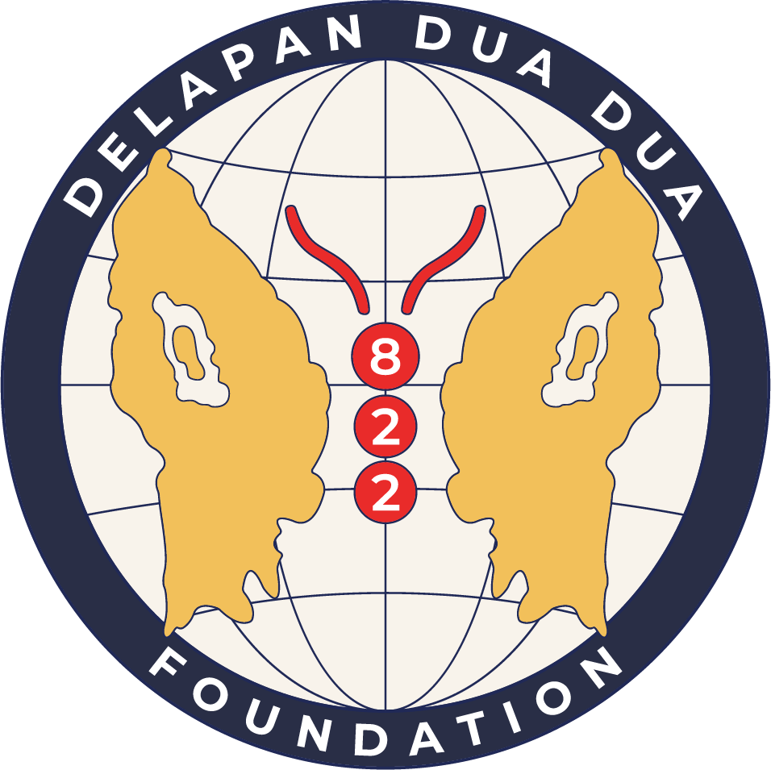

<!DOCTYPE html>
<html lang="en">
<head>
    <meta charset="UTF-8">
    <meta name="viewport" content="width=, initial-scale=1.0">
    <title>822 FOUNDATION</title>

      
    <!-- fonts -->
    <link rel="preconnect" href="https://fonts.googleapis.com">
    <link rel="preconnect" href="https://fonts.gstatic.com" crossorigin>
    <link href="https://fonts.googleapis.com/css2?family=Poppins:ital,wght@0,400;0,700;1,200;1,700&display=swap" rel="stylesheet">

    <!-- Feather Icons -->
    
    <!-- My style -->
    
    <link rel="stylesheet" href="style.css">
</head>
<body>
    <!-- Navbar Start  -->
    <nav class="navbar">
        

            
            <a href="#" class="navbar-logo">822FOUNDATION</a>
        

        

                <a href="#Home">Home</a> 
                <a href="about.html">Tentang Kami</a> 
                <a href="Activity.html">Aktivitas</a> 
                <a href="artikel.html">Artikel</a>
                <a href="contact.html">Kontak Kami</a>
                <a href="#">Donasi</a>
        

        

            <a href="#" id="Search"><i data-feather="search"></i></a>
            <a href="#" id="Hamburger-menu"><i data-feather="menu"></i></a>
        

        
    </nav>
    <!-- Navbar End -->

    <!-- Hero Section Start-->
    
    <section class="hero" id="Home">
        <main class="content">
            <h1>ALL PEOPLE ACTION </hl>
            
822 foundation

            <a href="about.html" class="know">Know More</a>
        </main>
    </section>
    <!-- Hero Section End-->
   <!-- footer start-->
    <footer>
        

            <h3>www.822foundation.html</h3>
            <h3>Menu</h3>
            <ul>
               <li>
                <a href="#Home">Home</a> 
                <a href="about.html">Tentang Kami</a> 
                <a href="Activity.html">Aktivitas</a> 
                <a href="artikel.html">Artikel</a>
                <a href="contact.html">Kontak Kami</a>
                </li> 
            </ul>
            <h3>&copy; 2023</h3>   
        
 
    </footer>
   <!-- footer end-->
    <!-- fetaher icons -->
    

    <!-- My Java Script -->
    
</body>
</html>
